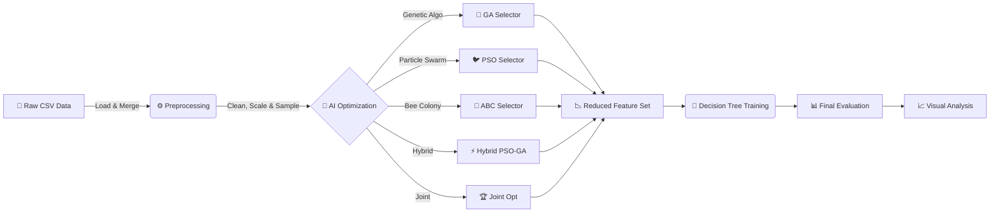
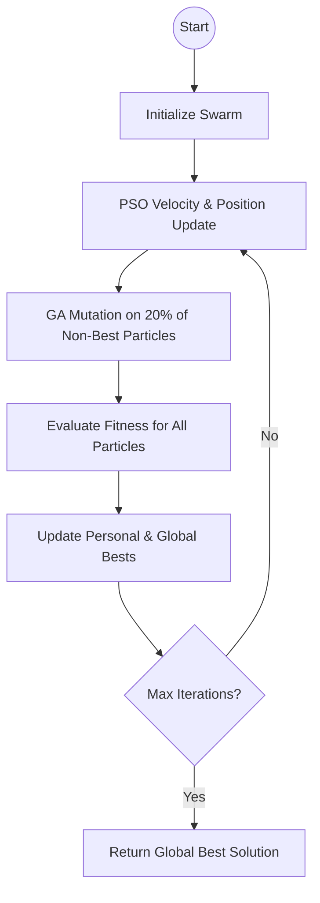
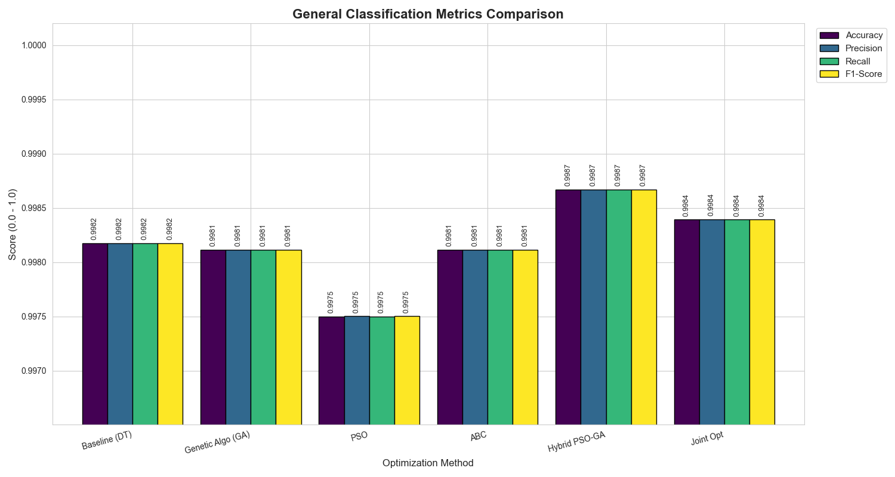
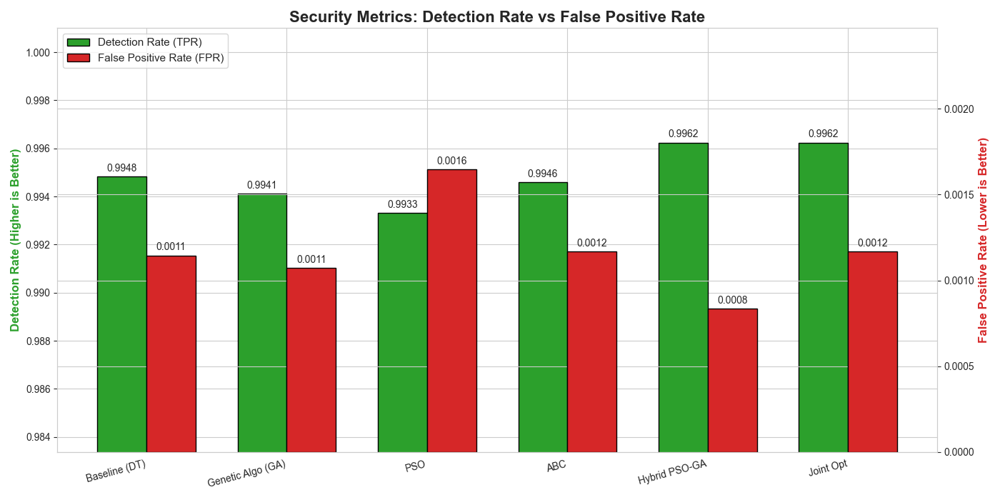
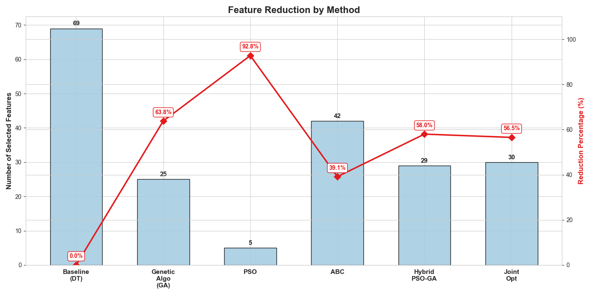
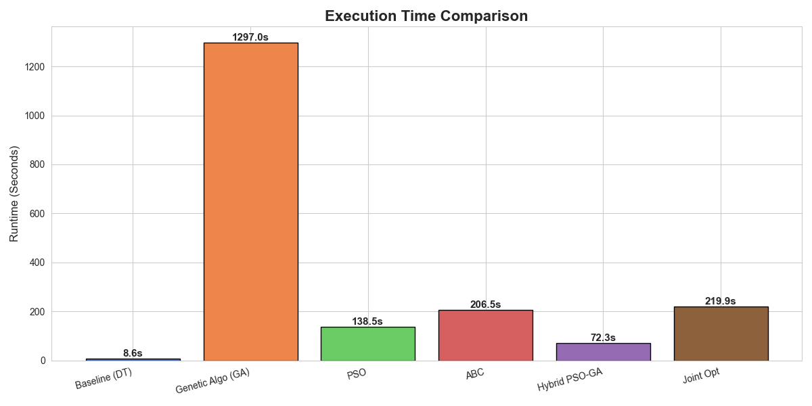
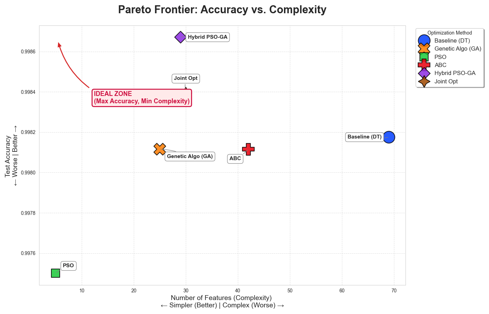

# 🛡️ Intrusion Detection System (IDS) Feature Selection Project


This project trains and evaluates state-of-the-art **Metaheuristic AI Algorithms** to optimize Network Intrusion Detection Systems (IDS). It solves the "Curse of Dimensionality" by automatically identifying the most critical attack signatures from network traffic features.

---

## 📑 Table of Contents
- [System Architecture](#-system-architecture)
- [Performance Benchmarks](#-performance-benchmarks-latest-experiments)
- [Theoretical Concepts](#-theoretical-concepts--mathematics)
- [Visualizations](#-visualizations)
- [Notebooks](#-notebooks)
- [Setup & Usage](#-step-by-step-setup-guide)
- [Configuration](#-configuration)
- [Project Structure](#-project-structure)

---

## 🏗️ System Architecture

The project follows a modular pipeline designed for reproducibility and scalability.



---

## 📊 Performance Benchmarks (Latest Experiments)

The following results demonstrate the system's performance using **10% of the CICIDS2017 dataset** (stratified sampling). The **Hybrid PSO-GA** method currently achieves the highest accuracy while also being the fastest optimization method.

| Method | Accuracy | Precision | Recall | F1-Score | TPR (Detection Rate) | FPR | Selected Features | Reduction % | Training Time |
| :--- | :---: | :---: | :---: | :---: | :---: | :---: | :---: | :---: | :---: |
| **Baseline (Decision Tree)** | 99.82% | 99.82% | 99.82% | 99.82% | 99.44% | 0.11% | 77 (All) | 0% | ~6s |
| **Genetic Algorithm (GA)** | 99.76% | 99.76% | 99.76% | 99.76% | 99.41% | 0.11% | 27 | 64.9% | ~359s |
| **PSO** | 99.75% | 99.75% | 99.75% | 99.75% | 99.33% | 0.16% | 5 | 93.5% | ~138s |
| **Artificial Bee Colony (ABC)** | 99.81% | 99.81% | 99.81% | 99.81% | 99.46% | 0.12% | 30 | 61.0% | ~405s |
| **Hybrid PSO-GA** 🏆 | **99.84%** | **99.84%** | **99.84%** | **99.84%** | **99.62%** | **0.08%** | **47** | **38.9%** | **~184s** |
| **Joint Optimization** | 99.83% | 99.83% | 99.83% | 99.83% | 99.62% | 0.12% | 30 | 61.0% | ~219s |

> **Analyst Notes**:
> *   **PSO** offers the most aggressive feature reduction (using only **5 features** out of 77!) with 93.5% reduction while maintaining 99.75% accuracy.
> *   **Hybrid PSO-GA** achieves the highest accuracy (99.84%) — surpassing even the Baseline — while using less than half the features and being the fastest optimizer (~184s).
> *   **Joint Optimization** (Feature + Hyperparameter tuning) reaches 99.83% accuracy by co-optimizing Decision Tree parameters alongside features.

---

## 🧠 Theoretical Concepts & Mathematics

This project defines Feature Selection as a **Binary Optimization Problem**. The goal is to find a binary vector $X = \{x_1, x_2, ..., x_D\}$ where $x_i \in \{0,1\}$ that maximizes a fitness function. Each method uses its own fitness formulation:

<details>
<summary><strong>1. Genetic Algorithm (GA) 🧬</strong></summary>

Based on Darwinian natural selection. A population of "chromosomes" (binary strings) evolves over generations using the [PyGAD](https://pygad.readthedocs.io/) library.

*   **Selection**: Steady-State Selection (SSS) picks the fittest individuals.
*   **Crossover**: Single-point crossover swaps gene segments between two parents.
*   **Mutation**: Random genes are flipped (0 $\to$ 1) with a configurable mutation rate to introduce diversity.

**Fitness Function** — Combines accuracy with a **feature correlation penalty** to encourage selecting uncorrelated features:

$$ Fitness_{GA} = \frac{Accuracy + (1 - \overline{|Corr|})}{2} $$

Where $\overline{|Corr|}$ is the mean absolute pairwise correlation among selected features. This discourages redundant feature sets.

</details>

<details>
<summary><strong>2. Particle Swarm Optimization (PSO) 🐦</strong></summary>

Simulates the social behavior of bird flocks using the [PySwarms](https://pyswarms.readthedocs.io/) library with a Binary PSO implementation.

*   **Concept**: "Particles" fly through a binary search space where each dimension represents a feature (1 = selected, 0 = not).
*   **Movement Equation**: A particle's velocity $V$ is updated based on:
    *   **Inertia ($w$)**: Keeps it moving in the same direction.
    *   **Cognitive ($c_1$)**: Pulls it towards its own personal best position ($P_{best}$).
    *   **Social ($c_2$)**: Pulls it towards the swarm's global best position ($G_{best}$).

$$ V_{t+1} = w V_t + c_1 r_1 (P_{best} - X_t) + c_2 r_2 (G_{best} - X_t) $$

**Fitness Function** — Minimizes a weighted sum of classification error and feature ratio:

$$ J_{PSO} = \alpha \cdot (1 - Accuracy) + (1 - \alpha) \cdot \frac{\text{Selected Features}}{\text{Total Features}} $$

Where $\alpha = 0.9$ prioritizes accuracy over feature reduction.

</details>

<details>
<summary><strong>3. Artificial Bee Colony (ABC) 🐝</strong></summary>

Simulates the foraging behavior of honey bees with a custom implementation.

*   **Employed Bees**: Search locally around known food sources.
    $$ v_{ij} = x_{ij} + \phi_{ij} (x_{ij} - x_{kj}) $$
*   **Onlooker Bees**: Select food sources probabilistically based on their fitness (nectar amount).
*   **Scout Bees**: If a food source is exhausted (no improvement after `limit` trials), the bee abandons it and discovers a completely random new source (global exploration).

**Fitness Function**:

$$ Fitness_{ABC} = Accuracy + 0.001 \cdot (1 - \frac{\text{Selected Features}}{\text{Total Features}}) $$

</details>

<details>
<summary><strong>4. Hybrid PSO-GA ⚡</strong></summary>

Combines the strengths of both algorithms in a custom implementation.

*   **PSO Phase**: Uses standard velocity-position updates with constriction coefficients ($w = 0.729$, $c_1 = c_2 = 1.49445$) to quickly converge towards promising regions.
*   **GA Phase**: Applies **Mutation** to 20% of non-best particles each iteration. For each selected particle, 5% of its genes are randomly re-initialized, preventing premature convergence.

**Fitness Function** — Same as ABC:

$$ Fitness_{Hybrid} = Accuracy + 0.001 \cdot (1 - \frac{\text{Selected Features}}{\text{Total Features}}) $$



</details>

<details>
<summary><strong>5. Joint Optimization (Feature Selection + Hyperparameter Tuning) 🏆</strong></summary>

Standard feature selection fixes the classifier settings (e.g., default Decision Tree). This can be misleading.

*   **Problem**: A feature set might look "bad" just because the Decision Tree was too shallow or too deep for those specific features.
*   **Solution**: We optimize a single extended particle vector containing **BOTH** features and hyperparameters:

    ```
    Particle = [ F_1, F_2, ... F_77 | Max_Depth, Min_Samples_Split, Criterion ]
    ```

    The 3 hyperparameter dimensions are decoded as:
    | Parameter | Continuous Range | Decoded Value |
    | :--- | :---: | :--- |
    | `max_depth` | $[0, 1)$ | $1 + \lfloor p_0 \times 29 \rfloor$ → range [1, 30] |
    | `min_samples_split` | $[0, 1)$ | $2 + \lfloor p_1 \times 18 \rfloor$ → range [2, 20] |
    | `criterion` | $[0, 1)$ | `entropy` if $p_2 > 0.5$, else `gini` |

*   **Optimizer**: Uses Hybrid PSO-GA (velocity updates + mutation on non-best particles).

**Fitness Function**:

$$ Fitness_{Joint} = Accuracy + \alpha \cdot (1 - \frac{\text{Selected Features}}{\text{Total Features}}) $$

Where $\alpha = 0.002$ provides a very small incentive for feature reduction, letting accuracy dominate.

*   **Result**: The algorithm searches for the optimal *combination* of data and model complexity simultaneously.

</details>

---

## 📊 Visualizations

After running the **Analysis** step (`python main.py --mode compare`), the system generates the following insight graphs in `results/plots/`.

### 1. General Performance & Security
| General Metrics | Security Metrics |
| :---: | :---: |
|  |  |
| *Comparison of Accuracy, Precision, Recall, and F1-Score* | *Detection Rate (TPR) vs. False Positive Rate (FPR)* |

### 2. Efficiency Analysis
| Feature Reduction | Runtime Comparison |
| :---: | :---: |
|  |  |
| *Number of features selected and reduction percentage* | *Execution time (seconds) per method* |

### 3. Pareto Frontier
| Pareto Frontier (Trade-off) |
| :---: |
|  |
| *Accuracy vs. Complexity — "Ideal Zone" is top-left (high accuracy, few features)* |

Additionally, each optimization method generates its own **convergence history plot** during training (e.g., `ga_history.png`, `pso_history.png`, etc.) showing how fitness/accuracy/feature count evolve across iterations.

---

## 📓 Notebooks

The `notebooks/` directory contains step-by-step Jupyter notebooks for interactive exploration and experimentation:

| # | Notebook | Description |
| :---: | :--- | :--- |
| 1 | `1_Data_Preprocessing.ipynb` | Load, merge, clean, and preprocess the raw CICIDS2017 dataset with stratified sampling. |
| 2 | `2_Baseline_DecisionTree.ipynb` | Train a C4.5 Decision Tree classifier as the baseline benchmark on all features. |
| 3 | `3_GA_FeatureSelection.ipynb` | Genetic Algorithm-based feature selection using PyGAD with correlation-aware fitness. |
| 4 | `4_PSO_FeatureSelection.ipynb` | Particle Swarm Optimization feature selection using PySwarms Binary PSO. |
| 5 | `5_ABC_FeatureSelection.ipynb` | Artificial Bee Colony algorithm for feature selection. |
| 6 | `6_Hybrid_PSOGA_FeatureSelection.ipynb` | Hybrid PSO-GA combining swarm dynamics with genetic mutation for feature selection. |
| 7 | `7_Hybrid_PSOGA_WrapperBasedJointOptimization.ipynb` | Joint optimization of features **and** Decision Tree hyperparameters simultaneously. |
| 8 | `8_Final_Performance_Analysis.ipynb` | Compare all methods with performance tables and visualizations. |

---

## 📋 Prerequisites

Before you begin, ensure you have the following installed on your computer:
*   **Python 3.8 or higher**: [Download Python](https://www.python.org/downloads/)
*   **Git** (Version control tool): [Download Git](https://git-scm.com/downloads)

---

## 🚀 Step-by-Step Setup Guide

Follow these steps exactly to get the project running.

### 1️⃣ Install the Project

1.  Open your **Command Prompt** (cmd) or **Terminal**.
2.  Navigate to the folder where you want to store the project.
3.  Clone (download) the repository and enter the directory:
    ```bash
    git clone <your-repo-url-here>
    cd Intrusion-Detection-System
    ```
4.  **Install the required libraries**:
    ```bash
    pip install -r requirements.txt
    ```
    *If `requirements.txt` is missing, install manually:*
    ```bash
    pip install pandas numpy scikit-learn matplotlib seaborn pyyaml tqdm joblib pygad pyswarms
    ```

### 2️⃣ Prepare the Dataset

This project is built for the **CICIDS2017** dataset but supports any generic CSV with a label column.

1.  The `data/raw/` directory should already exist in the project.
2.  **Copy all your CSV files** into `data/raw/`.

> **Supported label columns**: The system auto-detects columns named `Label`, `label`, `class`, `Class`, or `target`. If none are found, the last column is used. String labels like `BENIGN`/`NORMAL` are automatically mapped to `0` (benign) and all other labels to `1` (attack).

### 3️⃣ Preprocess the Data

Combine and clean the raw CSV files into a single training-ready dataset.

```bash
python main.py --mode preprocess
```
*   **Auto-Cleaning**: Handles infinity values, missing values, duplicates, duplicate columns (e.g., `.1` suffixes), and non-numeric columns.
*   **Scaling**: MinMaxScaler normalization is applied during training.
*   **Sampling**: Stratified sampling based on `sample_fraction` in config (default 10%).
*   **Output**: Saves `data/processed/processed_cicids2017.csv`.

### 4️⃣ Train the Models

Run specific optimization algorithms to find the best feature subsets.

| Algorithm | Command | Description |
| :--- | :--- | :--- |
| **Baseline** | `python main.py --mode train --method baseline` | Standard Decision Tree on ALL features (control experiment). |
| **Genetic Algorithm** | `python main.py --mode train --method ga` | Evolutionary feature selection with correlation-aware fitness. |
| **PSO** | `python main.py --mode train --method pso` | Binary Particle Swarm. Fastest convergence, highest reduction. |
| **ABC** | `python main.py --mode train --method abc` | Artificial Bee Colony. Robust exploration with scout bees. |
| **Hybrid PSO-GA** | `python main.py --mode train --method hybrid` | **Highest Accuracy**. Combines PSO speed with GA mutation. |
| **Joint Opt** | `python main.py --mode train --method joint` | Co-optimizes features + Decision Tree hyperparameters. |
| **Train ALL** | `python main.py --mode train --method all` | Runs Baseline + all optimization methods sequentially. |
| **Full Pipeline** | `python main.py --mode all` | Preprocess → Train all methods → Generate analysis plots. |

Each training run saves:
*   **Metrics** to `results/results/<method>_metrics.json` (Accuracy, Precision, Recall, F1, TPR, FPR, feature count, runtime).
*   **Convergence plot** to `results/plots/<method>_history.png`.

### 5️⃣ Compare Results & Visualize

Generate comparison charts and tables to see which method wins.

```bash
python main.py --mode compare
```
*   **What this does**:
    1.  Prints the **Consolidated Results Table** to the console.
    2.  Saves high-quality plots to `results/plots/`:
        *   `1_general_metrics.png` — Accuracy, Precision, Recall, and F1-Score bar chart.
        *   `2_security_metrics.png` — Detection Rate (TPR) vs. False Positive Rate (FPR) dual-axis chart.
        *   `3_feature_reduction.png` — Feature count bars with reduction percentage overlay.
        *   `4_runtime_comparison.png` — Execution time comparison across methods.
        *   `5_pareto_frontier.png` — Accuracy vs. Complexity scatter with "Ideal Zone" annotation.

---

## ⚙️ Configuration

All hyperparameters are centralized in `config/config.yaml` — no code changes needed:

```yaml
data:
  raw_path: "data/raw"                          # Directory containing raw CSV files
  processed_path: "data/processed/processed_cicids2017.csv"
  test_size: 0.2                                # 80/20 train-test split
  random_state: 42
  sample_fraction: 0.1                          # Use 10% of data. Set to 1.0 for full training.

model:
  decision_tree:
    criterion: "entropy"                        # C4.5 algorithm (entropy-based)
    random_state: 42
    max_depth: null                             # No depth limit for baseline

ga:
  population_size: 20                           # Number of chromosomes per generation
  num_generations: 10                           # Evolution iterations
  mutation_percent_genes: 10                    # % of genes mutated per offspring

pso:
  n_particles: 15                               # Swarm size
  n_iterations: 10                              # PSO iterations
  c1: 0.5                                       # Cognitive acceleration
  c2: 0.3                                       # Social acceleration
  w: 0.9                                        # Inertia weight

abc:
  colony_size: 20                               # Number of food sources
  n_iterations: 10                              # Foraging cycles
  limit: 3                                      # Abandonment threshold for scout bees

hybrid:
  n_particles: 20                               # Swarm size
  n_iterations: 10                              # PSO-GA iterations
  w: 0.729                                      # Constriction coefficient
  c1: 1.49445                                   # Cognitive component
  c2: 1.49445                                   # Social component

joint:
  n_particles: 30                               # Swarm size (larger for joint search)
  n_iterations: 20                              # More iterations for dual optimization
  alpha: 0.002                                  # Feature reduction weight in fitness
```

---

## 📂 Project Structure

```
Intrusion-Detection-System/
│
├── main.py                     # 🚀 CLI entry point (preprocess, train, compare, all)
├── requirements.txt            # 📦 Python dependencies
├── README.md                   # 📖 This guide
├── LICENSE                     # ⚖️ MIT License
│
├── config/
│   └── config.yaml             # ⚙️ All hyperparameters and paths
│
├── data/
│   ├── raw/                    # 📥 Place original CSV files here
│   └── processed/
│       └── processed_cicids2017.csv  # 📤 Auto-generated cleaned dataset
│
├── notebooks/                  # 📓 Step-by-step Jupyter notebooks (1–8)
│   ├── 1_Data_Preprocessing.ipynb
│   ├── 2_Baseline_DecisionTree.ipynb
│   ├── 3_GA_FeatureSelection.ipynb
│   ├── 4_PSO_FeatureSelection.ipynb
│   ├── 5_ABC_FeatureSelection.ipynb
│   ├── 6_Hybrid_PSOGA_FeatureSelection.ipynb
│   ├── 7_Hybrid_PSOGA_WrapperBasedJointOptimization.ipynb
│   └── 8_Final_Performance_Analysis.ipynb
│
├── src/                        # 🐍 Core Source Code
│   ├── __init__.py
│   ├── data_loader.py          # Robust data loading, cleaning & splitting
│   ├── utils.py                # Evaluation metrics & Pareto plotting
│   ├── analysis.py             # Comparative visualization (5 plot types)
│   └── models/
│       ├── __init__.py
│       ├── base_model.py       # Abstract base class for all selectors
│       ├── ga_selector.py      # Genetic Algorithm (PyGAD)
│       ├── pso_selector.py     # Particle Swarm Optimization (PySwarms)
│       ├── abc_selector.py     # Artificial Bee Colony (custom)
│       ├── hybrid_selector.py  # Hybrid PSO-GA (custom)
│       └── joint_selector.py   # Joint Feature + Hyperparameter Optimization
│
└── results/                    # 📊 Auto-generated outputs
    ├── results/                # JSON metrics files
    │   ├── baseline_metrics.json
    │   ├── ga_metrics.json
    │   ├── pso_metrics.json
    │   ├── abc_metrics.json
    │   ├── hybrid_metrics.json
    │   └── joint_metrics.json
    └── plots/                  # 📈 Comparison & convergence plots
        ├── 1_general_metrics.png
        ├── 2_security_metrics.png
        ├── 3_feature_reduction.png
        ├── 4_runtime_comparison.png
        ├── 5_pareto_frontier.png
        └── <method>_history.png  # Per-method convergence plots
```