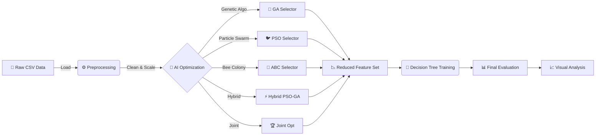
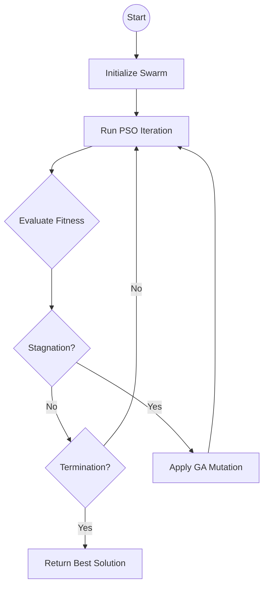

# 🛡️ Intrusion Detection System (IDS) Feature Selection Project


This project trains and evaluates state-of-the-art **Metaheuristic AI Algorithms** to optimize Network Intrusion Detection Systems (IDS). It solves the "Curse of Dimensionality" by automatically identifying the most critical attack signatures.

---

## 📑 Table of Contents
- [System Architecture](#-system-architecture)
- [Performance Benchmarks](#-performance-benchmarks-latest-experiments)
- [Theoretical Concepts](#-theoretical-concepts--mathematics)
- [Visualizations](#-visualizations)
- [Setup & Usage](#-step-by-step-setup-guide)
- [Configuration](#-configuration)

---

## 🏗️ System Architecture

The project follows a modular pipeline designed for reproducibility and scalability.



---

## 📊 Performance Benchmarks (Latest Experiments)

The following results demonstrate the system's performance using **10% of the CICIDS2017 dataset**. The **Joint Optimization** method currently achieves the highest accuracy with a well-balanced feature set.

| Method | Accuracy | Precision | Recall | Selected Features | Reduction % | Training Time |
| :--- | :---: | :---: | :---: | :---: | :---: | :---: |
| **Baseline (Decision Tree)** | 99.81% | 99.81% | 99.81% | 77 (All) | 0% | ~0s |
| **Genetic Algorithm (GA)** | 99.66% | 99.66% | 99.66% | 24 | **68.8%** | ~217s |
| **PSO** | 99.72% | 99.72% | 99.72% | **7** | **90.9%** | ~170s |
| **Artificial Bee Colony (ABC)**| 99.76% | 99.76% | 99.76% | 30 | 61.0% | ~406s |
| **Hybrid PSO-GA** | 99.80% | 99.80% | 99.80% | 38 | 50.6% | ~130s |
| **Joint Optimization** 🏆 | **99.86%** | **99.86%** | **99.86%** | 27 | 64.9% | ~187s |

> **Analyst Note**: 
> *   **PSO** offers the highest reduction (using only 7 features!) while losing minimal accuracy.
> *   **Joint Optimization** (Feature + Hyperparameter tuning) outperforms even the Baseline model using only 1/3rd of the features.

---
## 🧠 Theoretical Concepts & Mathematics

This project defines Feature Selection as a **Binary Optimization Problem**. The goal is to find a binary vector $X = \{x_1, x_2, ..., x_D\}$ where $x_i \in \{0,1\}$ that maximizes a fitness function.

$$ Fitness = \omega \cdot Accuracy + (1 - \omega) \cdot (1 - \frac{\text{Selected Features}}{\text{Total Features}}) $$

*(Where $\omega$ is a weight constant, typically 0.99, prioritizing accuracy over reduction).*

<details>
<summary><strong>1. Genetic Algorithm (GA) 🧬</strong></summary>

Based on Darwinian natural selection. A population of "chromosomes" (binary strings) evolves over generations.
*   **Selection**: Individuals are selected based on Fitness.
*   **Crossover**: Two parents swap segments of their genes to create offspring.
*   **Mutation**: Random bits are flipped (0 $\to$ 1) to introduce diversity and prevent getting stuck in local optima.

</details>

<details>
<summary><strong>2. Particle Swarm Optimization (PSO) 🐦</strong></summary>

Simulates the social behavior of bird flocks.
*   **Concept**: "Particles" fly through the search space.
*   **Movement Equation**: A particle's velocity $V$ is updated based on:
    *   **Inertia ($w$)**: Keeps it moving in the same direction.
    *   **Cognitive ($c_1$)**: Pulls it towards its own personal best position ($P_{best}$).
    *   **Social ($c_2$)**: Pulls it towards the swarm's global best position ($G_{best}$).

$$ V_{t+1} = w V_t + c_1 r_1 (P_{best} - X_t) + c_2 r_2 (G_{best} - X_t) $$

</details>

<details>
<summary><strong>3. Artificial Bee Colony (ABC) 🐝</strong></summary>

Simulates the foraging behavior of honey bees.
*   **Employed Bees**: Search primarily around known food sources (local search).
    $$ v_{ij} = x_{ij} + \phi_{ij} (x_{ij} - x_{kj}) $$
*   **Onlooker Bees**: Select food sources probabilistically based on their "nectar amount" (fitness).
*   **Scout Bees**: If a food source is exhausted (no improvement), the bee abandons it and finds a completely random new source (Global Search).

</details>

<details>
<summary><strong>4. Hybrid PSO-GA ⚡</strong></summary>

Combines the strengths of both algorithms.
*   **PSO Phase**: Uses swarm dynamics to quickly converge towards promising regions.
*   **GA Phase**: Applies **Mutation** to the swarm. If particles become too similar (stagnation), random mutations "kick" them out of local optima, allowing PSO to resume searching elsewhere.



</details>

<details>
<summary><strong>5. Joint Optimization (The "Special Sauce") 🏆</strong></summary>

Standard feature selection fixes the classifier settings (e.g., Default Decision Tree). This can be misleading.
*   **Problem**: A feature set might look "bad" just because the Decision Tree was too shallow or too deep for those specific features.
*   **Solution**: We optimize a single vector containing **BOTH** features and hyperparameters:
    `Particle = [ F_1, F_2, ... F_n | Max_Depth, Min_Split, Criterion ]`
*   **Result**: The algorithm searches for the optimal *combination* of data and model complexity simultaneously.

</details>

---
## Visualizations

After running the **Analysis** step (`python main.py --mode compare`), the system generates the following insight graphs in `results/plots/`.

### 1. General Performance & Security
| General Metrics | Security Metrics |
| :---: | :---: |
|  |  |
| *Comparison of Accuracy, F1-Score, etc.* | *Detection Rate (TPR) vs False Alarms (FPR)* |

### 2. Efficiency Analysis
| Feature Reduction | Pareto Frontier (Trade-off) |
| :---: | :---: |
|  |  |
| *Percentage of data removed* | *Accuracy vs. Complexity "Ideal Zone"* |

---

## 📋 Prerequisites

Before you begin, ensure you have the following installed on your computer:
*   **Python 3.8 or higher**: [Download Python](https://www.python.org/downloads/)
*   **Git** (Generic source control tool): [Download Git](https://git-scm.com/downloads)

---

## 🚀 Step-by-Step Setup Guide

Follow these steps exactly to get the project running.

### 1️⃣ Install the Project

1.  Open your **Command Prompt** (cmd) or **Terminal**.
2.  Navigate to the folder where you want to store the project.
3.  Clone (download) the repository and enter the directory:
    ```bash
    git clone <your-repo-url-here>
    cd Intrusion-Detection-System
    ```
4.  **Install the required libraries**:
    ```bash
    pip install -r requirements.txt
    ```
    *If `requirements.txt` is missing, install manually:*
    ```bash
    pip install pandas numpy scikit-learn matplotlib seaborn pyyaml tqdm joblib
    ```

### 2️⃣ Prepare the Dataset

This project is built for the **CICIDS2017** dataset but supports generic CSVs.

1.  Create a folder named `data` inside the project folder.
2.  Inside `data`, create another folder named `raw`.
3.  **Copy all your CSV files** into `data/raw/`.

### 3️⃣ Preprocess the Data

Combine and clean the raw CSV files into a single training-ready dataset.

```bash
python main.py --mode preprocess
```
*   **Auto-Cleaning**: Handles missing values, duplicates, and non-numeric columns automatically.
*   **Output**: Saves `data/processed/processed_cicids2017.csv`.

### 4️⃣ Train the Models

Run specific optimization algorithms to find the best feature subsets.

| Algorithm | Command | Description |
| :--- | :--- | :--- |
| **Baseline** | `python main.py --mode train --method baseline` | Standard Decision Tree on ALL features (Control). |
| **Genetic Algorithm** | `python main.py --mode train --method ga` | Biological evolution simulation. Good balance. |
| **PSO** | `python main.py --mode train --method pso` | Particle Swarm. Fast convergence, high reduction. |
| **ABC** | `python main.py --mode train --method abc` | Artificial Bee Colony. Good at avoiding local optima. |
| **Hybrid PSO-GA** | `python main.py --mode train --method hybrid` | Combines PSO speed with GA diversity. |
| **Joint Opt** | `python main.py --mode train --method joint` | **Best Accuracy**. Optimizes Features + Tree Params. |
| **Run ALL** | `python main.py --mode all` | Runs Baseline + All methods sequentially. |

### 5️⃣ Compare Results & Visualize

Generate comparison charts and tables to see which method wins.

```bash
python main.py --mode compare
```
*   **What this does**:
    1.  Prints the **Consolidated Results Table** (like the one at the top of this file).
    2.  Saves high-quality plots to `results/plots/`:
        *   `1_general_metrics.png`: Accuracy/F1 Score bars.
        *   `2_security_metrics.png`: Detection Rate vs False Alarms.
        *   `3_feature_reduction.png`: How many features were dropped.
        *   `5_pareto_frontier.png`: Trade-off between Complexity and Accuracy.

---

## ⚙️ Configuration

You can change settings in `config/config.yaml` without touching code:

```yaml
data:
  sample_fraction: 0.1  # Start small (10%) for testing. Set to 1.0 for full training.

ga:
  population_size: 20   # Higher = Better search, Slower speed
  num_generations: 10   # Higher = Better results
```

## 📂 Project Structure

```
Intrusion-Detection-System/
│
├── config/                 # ⚙️ Configuration (config.yaml)
├── data/                   
│   ├── raw/                # 📥 Place original CSVs here
│   └── processed/          # 📤 Processed file appears here
├── results/                
│   ├── plots/              # 📊 Generated graphs saved here
│   └── *.json              # 📄 Metric results for each run
├── src/                    # 🐍 Core Source Code
│   ├── models/             # Algorithms (GA, PSO, ABC, Joint)
│   ├── analysis.py         # Visualization Logic
│   └── data_loader.py      # Robust Data Processor
├── main.py                 # 🚀 Entry point script
└── README.md               # 📖 This guide
```